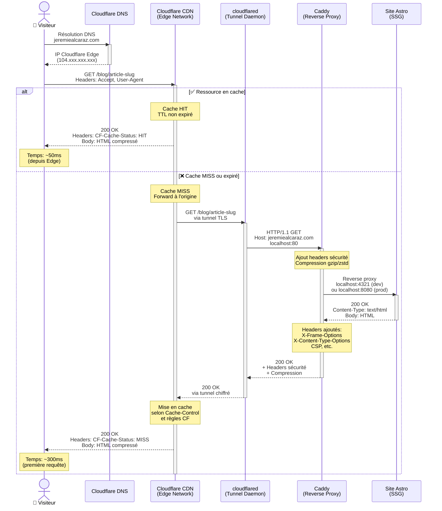
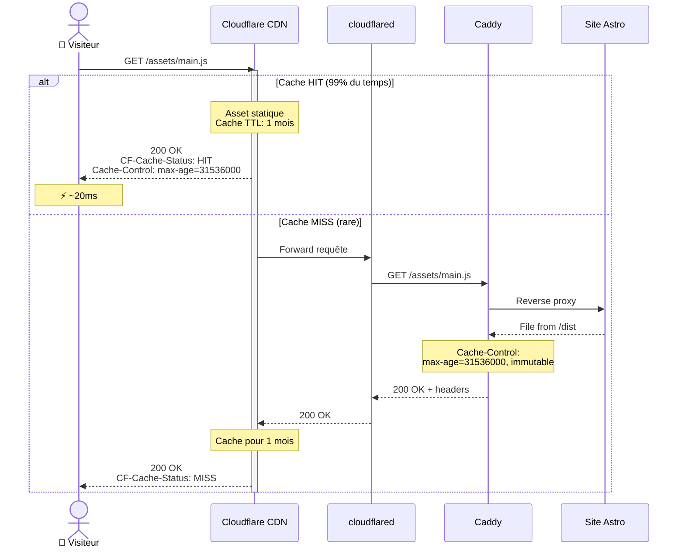
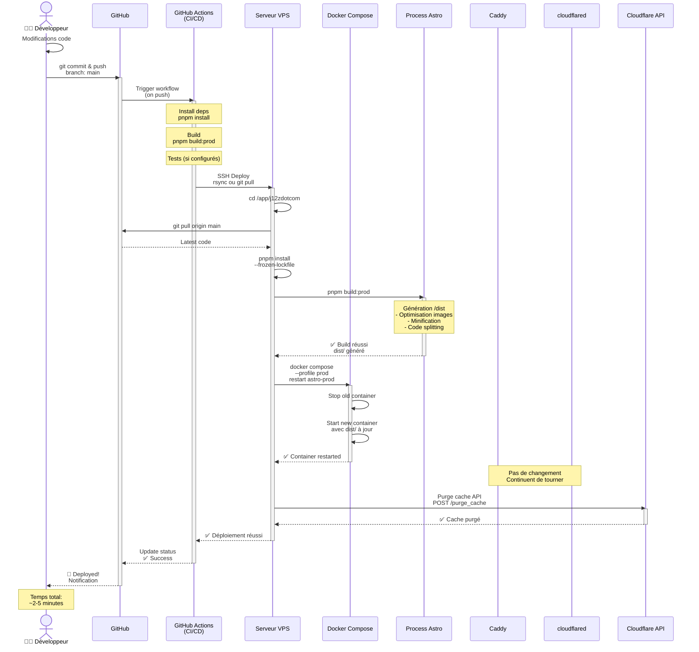
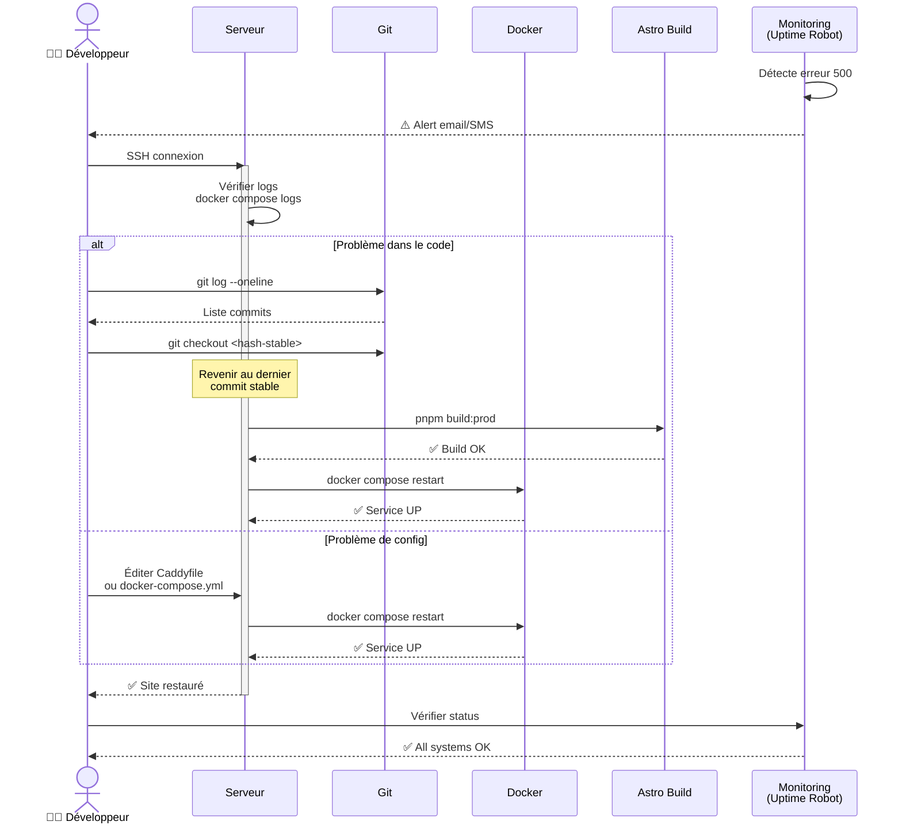
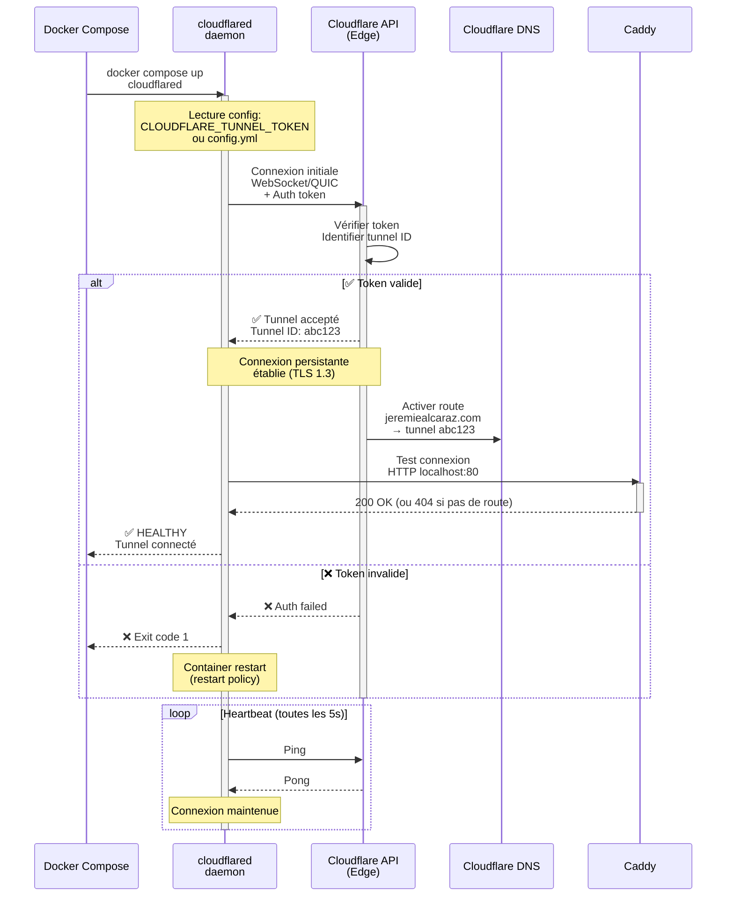
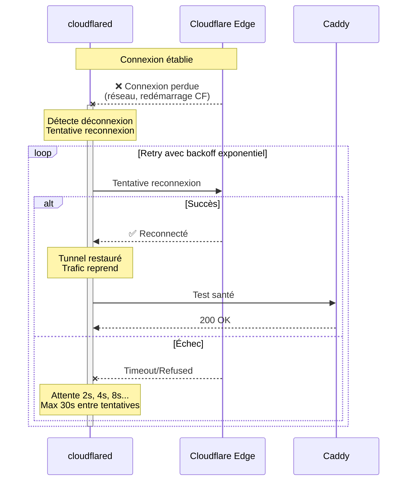
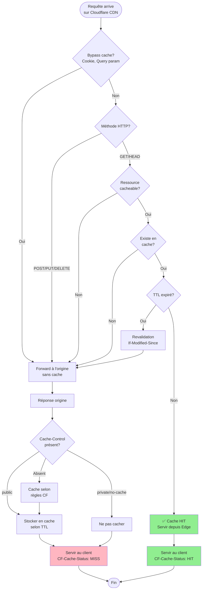
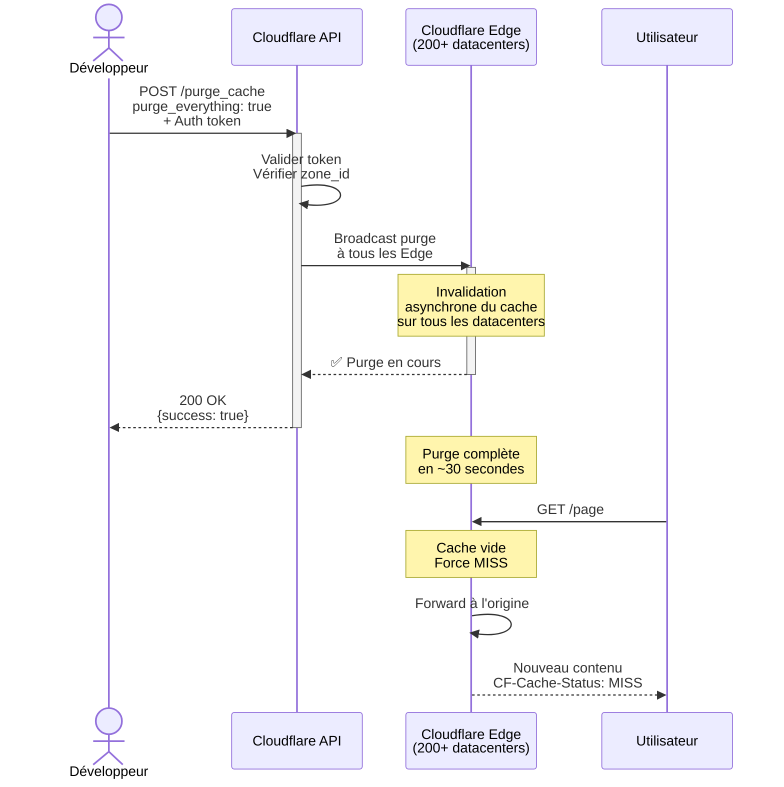
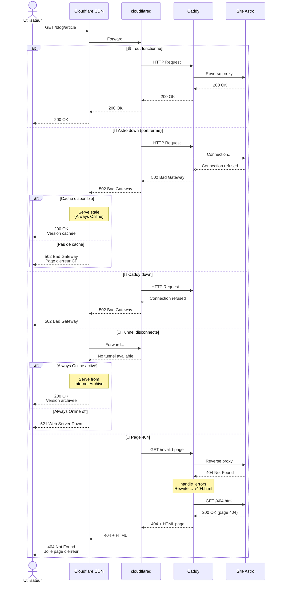
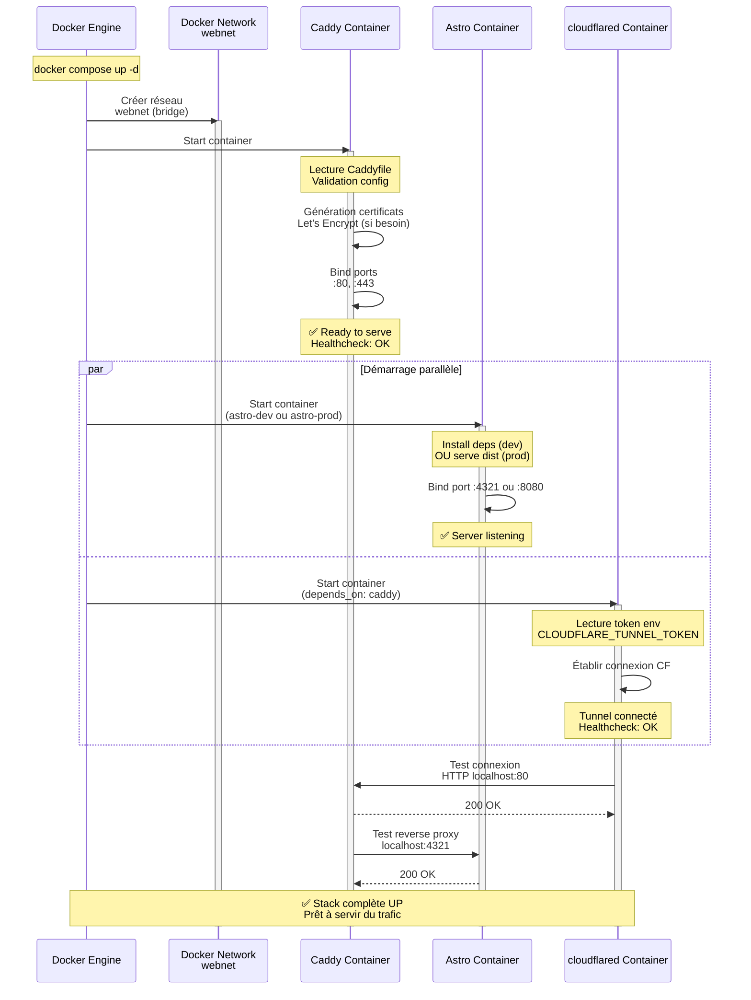

# Diagrammes d'architecture

Ce document contient les diagrammes de séquence et d'architecture pour comprendre le fonctionnement de l'infrastructure.

## Table des matières

- [Flux de requête HTTP](#flux-de-requête-http)
- [Déploiement d'une mise à jour](#déploiement-dune-mise-à-jour)
- [Connexion du tunnel Cloudflare](#connexion-du-tunnel-cloudflare)
- [Gestion du cache](#gestion-du-cache)
- [Gestion des erreurs](#gestion-des-erreurs)
- [Initialisation au démarrage](#initialisation-au-démarrage)

---

## Flux de requête HTTP

### Requête réussie avec cache CDN

### Requête d'asset statique (CSS/JS/Image)

---

## Déploiement d'une mise à jour

### Pipeline de déploiement complet

### Rollback en cas d'erreur

---

## Connexion du tunnel Cloudflare

### Établissement initial du tunnel

### Reconnexion automatique après coupure

---

## Gestion du cache

### Décision de mise en cache

### Purge du cache après déploiement

---

## Gestion des erreurs

### Cascade d'erreurs et fallbacks

---

## Initialisation au démarrage

### Séquence de boot complète

---

## Notes sur les diagrammes

### Légende

- 🟢 **Succès**: Flux nominal sans erreur
- 🔴 **Erreur**: Cas d'échec avec gestion
- ⚡ **Performance**: Métrique de temps de réponse
- ✅ **Validation**: Check de santé ou validation

### Temps de réponse typiques

| Scénario | Temps moyen | Notes |
|----------|-------------|-------|
| Cache HIT (CDN) | 20-50ms | Depuis Edge le plus proche |
| Cache MISS (première requête) | 200-400ms | Dépend de la latence serveur |
| Asset statique (cache) | 15-30ms | Très cacheable |
| Page dynamique | N/A | Site 100% statique (SSG) |

### Points de défaillance

1. **Tunnel Cloudflare**
   - Reconnexion auto en ~5-10s
   - Fallback: Always Online (cache)

2. **Caddy**
   - Restart Docker en ~2-3s
   - Impact: 502 si pas de cache

3. **Site Astro**
   - Restart en ~5-10s (selon mode)
   - Impact: 502 temporaire

### Améliorations futures possibles

- Load balancing entre plusieurs serveurs
- Failover automatique multi-région
- Health checks plus sophistiqués
- Métriques Prometheus/Grafana
- Alerting avancé (PagerDuty, Slack)
