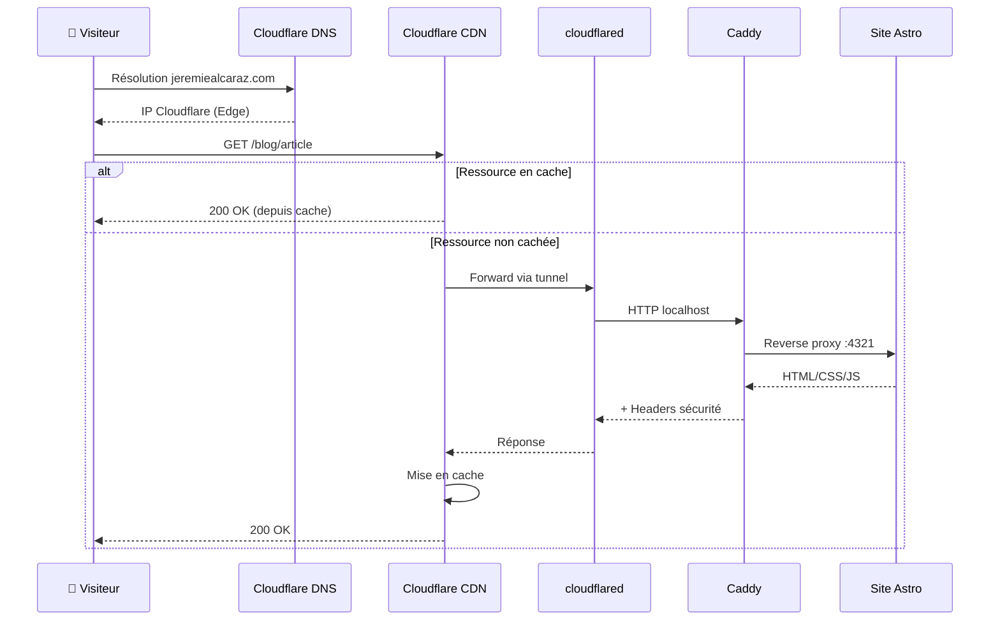
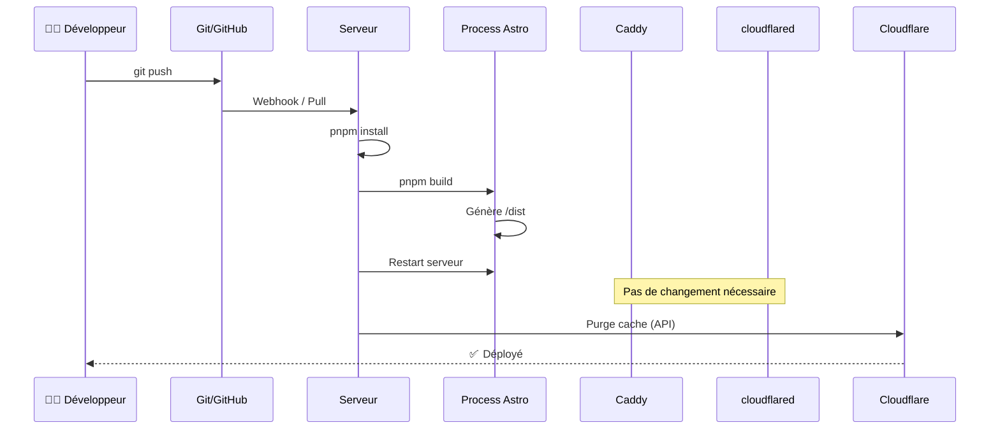

# Infrastructure - Architecture de déploiement

## Vue d'ensemble

Le projet j12zdotcom utilise une architecture moderne basée sur **Cloudflare Tunnel** et un **reverse proxy Caddy** pour servir le site de manière sécurisée et performante.

## Architecture

### Schéma général

```
Internet (jeremiealcaraz.com)
         │
         ▼
┌─────────────────────────────────────────┐
│  Cloudflare DNS + CDN                   │
│  - Gestion DNS                          │
│  - Cache global (Edge Caching)          │
│  - Protection DDoS (Layer 3/4/7)        │
│  - Firewall (WAF)                       │
│  - Optimisation (Rocket Loader, etc.)   │
└──────────────┬──────────────────────────┘
               │
               │ Tunnel chiffré TLS/WireGuard
               │ (Connexion sortante - pas d'IP publique nécessaire)
               │
               ▼
┌─────────────────────────────────────────┐
│  Serveur d'hébergement                  │
│  (VPS, machine locale, etc.)            │
│                                         │
│  ┌───────────────────────────────────┐ │
│  │ cloudflared (daemon)              │ │
│  │ - Maintient tunnel vers CF        │ │
│  │ - Pas de port public exposé       │ │
│  │ - Reconnexion automatique         │ │
│  └─────────────┬─────────────────────┘ │
│                │                         │
│                │ localhost              │
│                ▼                         │
│  ┌───────────────────────────────────┐ │
│  │ Caddy (Reverse Proxy)             │ │
│  │ Port: 80, 443                     │ │
│  │ - HTTPS automatique               │ │
│  │ - Compression (gzip, zstd)        │ │
│  │ - Headers sécurité                │ │
│  │ - Logs structurés                 │ │
│  │ - Health checks                   │ │
│  └─────────────┬─────────────────────┘ │
│                │                         │
│                │ localhost:4321 (dev)   │
│                │ localhost:8080 (prod)  │
│                ▼                         │
│  ┌───────────────────────────────────┐ │
│  │ Site Astro                        │ │
│  │ - Mode statique (SSG)             │ │
│  │ - Serveur de dev (astro dev)      │ │
│  │ - OU serveur static (serve dist)  │ │
│  └───────────────────────────────────┘ │
└─────────────────────────────────────────┘
```

## Composants

### 1. Cloudflare DNS + CDN

**Rôle**: Point d'entrée global pour tous les visiteurs

**Fonctionnalités**:
- Résolution DNS pour `jeremiealcaraz.com`
- Cache des ressources statiques sur 200+ datacenters
- Protection contre les attaques DDoS
- Web Application Firewall (WAF)
- Analytics et monitoring
- Optimisations automatiques (images, JavaScript, CSS)

**Configuration**:
- Type d'enregistrement: `CNAME` vers le tunnel Cloudflare
- Proxy activé (icône orange)
- SSL/TLS: Full (strict) recommandé

### 2. Cloudflare Tunnel (cloudflared)

**Rôle**: Connexion sécurisée entre Cloudflare et votre serveur

**Avantages**:
- ✅ **Pas d'IP publique nécessaire** - Connexion sortante uniquement
- ✅ **Pas de port ouvert** - Pas de risque d'attaque directe sur le serveur
- ✅ **Chiffrement bout-en-bout** - TLS entre CF et votre serveur
- ✅ **Reconnexion automatique** - Haute disponibilité
- ✅ **Multi-cloud/multi-server** - Loadbalancing possible
- ✅ **Zero Trust** - Authentification intégrée possible

**Fonctionnement**:
1. `cloudflared` démarre et se connecte à Cloudflare
2. Établit un tunnel persistant chiffré
3. Cloudflare route le trafic vers ce tunnel
4. Le daemon forward les requêtes vers Caddy

**Types de configuration**:
- **Token-based** (recommandé) - Un seul token via variable d'env
- **Config file** - Fichier YAML avec multiples tunnels/routes

### 3. Caddy (Reverse Proxy)

**Rôle**: Proxy HTTP/HTTPS entre cloudflared et le site Astro

**Avantages de Caddy**:
- ✅ HTTPS automatique avec Let's Encrypt (pas nécessaire avec CF Tunnel mais utile en local)
- ✅ Configuration ultra-simple (Caddyfile)
- ✅ Compression automatique (gzip, brotli, zstd)
- ✅ Headers de sécurité intégrés
- ✅ Logs structurés (JSON)
- ✅ Health checks
- ✅ Reloads sans downtime

**Responsabilités**:
- Recevoir les requêtes de cloudflared
- Ajouter les headers de sécurité
- Compresser les réponses
- Logger le trafic
- Forwarder vers le site Astro
- Gérer les erreurs (404, 500, etc.)

**Ports**:
- `80` - HTTP (redirigé vers HTTPS)
- `443` - HTTPS
- `443/udp` - HTTP/3 (QUIC)

### 4. Site Astro

**Rôle**: Application web statique

**Modes de fonctionnement**:

#### Mode Développement
- Serveur: `astro dev` sur port `4321`
- Hot Module Replacement (HMR)
- Source maps
- Logs détaillés

#### Mode Production
- Build: `pnpm build` → génère `/dist`
- Serveur: `serve dist` sur port `8080` (ou nginx, Apache, etc.)
- Fichiers optimisés (minifiés, compressés)
- Pas de HMR

**Configuration Astro**:
```typescript
export default defineConfig({
  site: 'https://jeremiealcaraz.com',
  output: 'static', // SSG uniquement
  image: {
    service: {
      entrypoint: 'astro/assets/services/sharp',
    },
  },
})
```

## Flux de données

### Requête HTTP entrante



### Déploiement d'une mise à jour



## Sécurité

### Niveaux de protection

1. **Cloudflare (Périmètre)**
   - DDoS protection (Layer 3/4/7)
   - WAF avec règles OWASP
   - Rate limiting
   - Bot detection
   - Captcha Challenge si nécessaire

2. **Cloudflare Tunnel (Transport)**
   - Chiffrement TLS 1.3
   - Authentification mutuelle
   - Pas d'exposition publique du serveur
   - Tunnel sortant uniquement

3. **Caddy (Application)**
   - Headers sécurité:
     - `X-Frame-Options: SAMEORIGIN`
     - `X-Content-Type-Options: nosniff`
     - `X-XSS-Protection: 1; mode=block`
     - `Content-Security-Policy`
     - `Referrer-Policy`
   - Compression sécurisée
   - Logs pour détection d'anomalies

4. **Serveur (Infrastructure)**
   - Firewall (iptables/UFW)
   - Mises à jour automatiques
   - Accès SSH restreint
   - Principe du moindre privilège
   - Isolation Docker (optionnel)

### Headers de sécurité implémentés

| Header | Valeur | Protection |
|--------|--------|------------|
| `X-Frame-Options` | `SAMEORIGIN` | Clickjacking |
| `X-Content-Type-Options` | `nosniff` | MIME sniffing |
| `X-XSS-Protection` | `1; mode=block` | XSS basique |
| `Referrer-Policy` | `strict-origin-when-cross-origin` | Fuites d'info |
| `Content-Security-Policy` | Configurable | XSS, injection |
| `Permissions-Policy` | Restrictive | Accès API navigateur |

## Performance

### Optimisations activées

1. **Cloudflare CDN**
   - Cache global (TTL configurable)
   - Minification auto (JS/CSS/HTML)
   - Brotli compression
   - HTTP/3 (QUIC)
   - Early Hints
   - Rocket Loader

2. **Caddy**
   - Compression gzip/zstd
   - HTTP/2 Server Push (si configuré)
   - Keep-Alive

3. **Astro**
   - Génération statique (pas de SSR)
   - Images optimisées (Sharp)
   - Code splitting
   - CSS/JS minifiés
   - Critical CSS inline

### Temps de réponse typiques

| Métrique | Valeur cible | Explication |
|----------|--------------|-------------|
| **TTFB** | < 200ms | Depuis cache CDN |
| **FCP** | < 1.5s | First Contentful Paint |
| **LCP** | < 2.5s | Largest Contentful Paint |
| **CLS** | < 0.1 | Cumulative Layout Shift |

## Monitoring

### Logs disponibles

1. **Cloudflare Analytics**
   - Trafic global
   - Cache hit ratio
   - Requêtes bloquées (bot, WAF)
   - Temps de réponse par pays

2. **Caddy Logs**
   - Localisation: `/var/log/caddy/`
   - Format: JSON structuré
   - Contenu: IP, méthode, path, status, latency
   - Rotation: 100MB max, 10 fichiers, 30 jours

3. **Application Logs**
   - Build logs (stdout)
   - Erreurs serveur (stderr)

### Commandes utiles

```bash
# Logs Caddy en temps réel
docker compose logs -f caddy

# Logs cloudflared
docker compose logs -f cloudflared

# Stats Caddy
docker exec j12z_caddy caddy version

# Test configuration Caddy
docker exec j12z_caddy caddy validate --config /etc/caddy/Caddyfile
```

## Scalabilité

### Scaling vertical (actuel)

Un seul serveur avec:
- Caddy (reverse proxy)
- cloudflared (tunnel)
- Site statique

**Limites**:
- ~10,000 req/s (suffisant pour un site vitrine)
- Dépend des ressources serveur (CPU/RAM)

### Scaling horizontal (futur)

Cloudflare Tunnel supporte:
- **Load balancing** entre plusieurs serveurs
- **Failover automatique** si un serveur tombe
- **Geo-routing** (serveur différent par région)

**Configuration requise**:
- Plusieurs serveurs avec cloudflared
- Configuration tunnel avec load balancer
- Même code déployé partout

## Coûts

| Service | Coût mensuel | Notes |
|---------|--------------|-------|
| **Cloudflare Free** | 0€ | Largement suffisant |
| **Cloudflare Tunnel** | 0€ | Inclus dans Free |
| **Serveur VPS** | 5-10€ | Hetzner, DigitalOcean, etc. |
| **Total** | **5-10€/mois** | + nom de domaine (~10€/an) |

### Alternatives Premium

- **Cloudflare Pro** (20$/mois): WAF avancé, image optimization
- **Cloudflare Business** (200$/mois): Support 24/7, uptime 100%

## Maintenance

### Mises à jour régulières

```bash
# Docker images
docker compose pull

# Dépendances Astro
cd /path/to/j12zdotcom
pnpm update

# Rebuild
pnpm build

# Restart services
docker compose restart
```

### Backups

**À sauvegarder**:
- Code source (déjà sur Git)
- Certificat tunnel Cloudflare (`cert.pem`)
- Token tunnel (variable d'env)
- Logs (si analyse nécessaire)
- Configuration Caddy

**Pas nécessaire**:
- `/dist` (régénéré au build)
- `node_modules` (régénéré via pnpm install)
- Certificats SSL Caddy (régénérés auto)

## Troubleshooting

### Le site ne répond pas

1. Vérifier Cloudflare Analytics (trafic arrive ?)
2. Vérifier tunnel: `docker compose logs cloudflared`
3. Vérifier Caddy: `docker compose logs caddy`
4. Vérifier site Astro: `curl localhost:4321`

### Erreur 502 Bad Gateway

- Caddy ne peut pas joindre le site Astro
- Vérifier que le serveur Astro tourne
- Vérifier le port dans Caddyfile

### Erreur 503 Service Unavailable

- Cloudflared ne peut pas joindre Caddy
- Vérifier que Caddy tourne
- Vérifier les logs cloudflared

### Cache Cloudflare ne se vide pas

```bash
# Purge total (API)
curl -X POST "https://api.cloudflare.com/client/v4/zones/{zone_id}/purge_cache" \
  -H "Authorization: Bearer {token}" \
  -H "Content-Type: application/json" \
  --data '{"purge_everything":true}'
```

## Références

- [Cloudflare Tunnel Docs](https://developers.cloudflare.com/cloudflare-one/connections/connect-apps/)
- [Caddy Documentation](https://caddyserver.com/docs/)
- [Astro Deployment Guide](https://docs.astro.build/en/guides/deploy/)
- [Docker Compose Reference](https://docs.docker.com/compose/)
