## 🚀 Introduction

Astro est déjà reconnu pour ses **performances exceptionnelles** grâce à son architecture unique et son approche "islands". Cependant, même avec un framework performant, il existe toujours des moyens d'optimiser davantage votre site pour offrir une expérience utilisateur incomparable.

> **💡 Le saviez-vous ?**
> Astro génère par défaut des sites avec **0 JavaScript côté client**, sauf si vous en avez explicitement besoin !

Dans ce guide complet, nous explorerons les techniques avancées pour maximiser les performances de votre site Astro et atteindre des scores parfaits sur les Core Web Vitals.

## 📊 Architecture et fonctionnement d'Astro

Avant d'optimiser, comprenons comment Astro fonctionne :


### Le concept des "Islands"

```astro
---
// components/InteractiveWidget.astro
// Ce composant sera hydraté côté client
---

<div class="widget">
  <button id="toggle">Cliquez-moi</button>
  <div id="content" class="hidden">Contenu dynamique !</div>
</div>

<script>
  // JavaScript uniquement pour ce composant
  document.getElementById('toggle')?.addEventListener('click', () => {
    const content = document.getElementById('content')
    content?.classList.toggle('hidden')
  })
</script>
```

## 🖼️ 1. Optimisation des images

### Images responsive avec Astro

```astro
---
// components/OptimizedImage.astro
import { Picture } from 'astro:assets'
import heroImage from '../assets/hero.jpg'
---

<Picture
  src={heroImage}
  alt="Description de l'image"
  widths={[240, 540, 720, 1280]}
  sizes="(max-width: 360px) 240px, (max-width: 720px) 540px, (max-width: 1600px) 720px, 1280px"
  formats={['avif', 'webp', 'jpeg']}
  loading="lazy"
  class="responsive-image"
/>
```

### Configuration avancée pour les images

```js
// astro.config.mjs
import { defineConfig } from 'astro/config'

export default defineConfig({
  image: {
    domains: ['images.unsplash.com', 'cdn.example.com'],
    remotePatterns: [
      {
        protocol: 'https',
        hostname: '**.amazonaws.com',
      },
    ],
  },
  experimental: {
    assets: true,
  },
})
```

> **⚠️ Attention !**
> Les images non optimisées peuvent représenter jusqu'à **70% du poids** d'une page web. Une optimisation correcte peut réduire le temps de chargement de **50% ou plus** !

## ⚡ 2. Stratégies de chargement avancées

### Lazy Loading intelligent

```astro
---
// components/LazyComponent.astro
const { threshold = 0.1, rootMargin = '100px' } = Astro.props
---

<div class="lazy-container" data-threshold={threshold} data-root-margin={rootMargin}>
  <slot />
</div>

<script>
  const observerOptions = {
    root: null,
    rootMargin: document.currentScript?.dataset.rootMargin || '100px',
    threshold: parseFloat(document.currentScript?.dataset.threshold || '0.1'),
  }

  const observer = new IntersectionObserver(entries => {
    entries.forEach(entry => {
      if (entry.isIntersecting) {
        // Charger le contenu
        entry.target.classList.add('loaded')
        observer.unobserve(entry.target)
      }
    })
  }, observerOptions)

  document.querySelectorAll('.lazy-container').forEach(el => {
    observer.observe(el)
  })
</script>
```

### Préchargement stratégique

```astro
---
// layouts/BaseLayout.astro
---

<head>
  <!-- Précharger les ressources critiques -->
  <link rel="preload" href="/fonts/inter-var.woff2" as="font" type="font/woff2" crossorigin />
  <link rel="preload" href="/css/critical.css" as="style" />

  <!-- DNS prefetch pour les domaines externes -->
  <link rel="dns-prefetch" href="//fonts.googleapis.com" />
  <link rel="dns-prefetch" href="//analytics.google.com" />

  <!-- Preconnect pour les ressources critiques -->
  <link rel="preconnect" href="https://fonts.gstatic.com" crossorigin />
</head>
```

## 🧹 3. Optimisation JavaScript et CSS

### Analyse du bundle

```bash
# Installer l'outil d'analyse
npm install --save-dev vite-bundle-analyzer

# Analyser votre bundle
npm run build -- --analyze
```

### Code splitting avancé

```astro
---
// pages/dashboard.astro
// Importer uniquement quand nécessaire
---

<div id="dashboard-container">
  <div class="skeleton-loader">Chargement...</div>
</div>

<script>
  async function loadDashboard() {
    // Import dynamique pour réduire le bundle initial
    const { DashboardWidget } = await import('../components/DashboardWidget.js')
    const { ChartLibrary } = await import('../lib/charts.js')

    const container = document.getElementById('dashboard-container')
    if (container) {
      // Initialiser le dashboard
      new DashboardWidget(container, {
        charts: ChartLibrary,
      })
    }
  }

  // Charger seulement quand l'utilisateur interagit
  document.addEventListener('DOMContentLoaded', () => {
    const trigger = document.querySelector('[data-load-dashboard]')
    trigger?.addEventListener('click', loadDashboard, { once: true })
  })
</script>
```

### CSS Critical Path

```astro
---
// layouts/BaseLayout.astro
---

<head>
  <style>
    /* CSS critique inline */
    body {
      font-family: system-ui, sans-serif;
      line-height: 1.6;
    }
    .hero {
      height: 100vh;
      display: flex;
      align-items: center;
    }
  </style>

  <!-- CSS non-critique chargé de manière asynchrone -->
  <link
    rel="preload"
    href="/css/main.css"
    as="style"
    onload="this.onload=null;this.rel='stylesheet'"
  />
  <noscript><link rel="stylesheet" href="/css/main.css" /></noscript>
</head>
```

## 📈 4. Surveillance des performances

### Core Web Vitals avec Astro

```js
// src/utils/performance.js
export class PerformanceMonitor {
  constructor() {
    this.metrics = {}
    this.initWebVitals()
  }

  async initWebVitals() {
    const { getCLS, getFID, getFCP, getLCP, getTTFB } = await import('web-vitals')

    getCLS(this.onCLS.bind(this))
    getFID(this.onFID.bind(this))
    getFCP(this.onFCP.bind(this))
    getLCP(this.onLCP.bind(this))
    getTTFB(this.onTTFB.bind(this))
  }

  onCLS(metric) {
    this.metrics.cls = metric.value
    this.sendToAnalytics('CLS', metric)
  }

  onFID(metric) {
    this.metrics.fid = metric.value
    this.sendToAnalytics('FID', metric)
  }

  // ... autres métriques

  sendToAnalytics(name, metric) {
    // Envoyer vers Google Analytics, DataDog, etc.
    if (typeof gtag !== 'undefined') {
      gtag('event', name, {
        custom_parameter_1: metric.value,
        custom_parameter_2: metric.rating,
      })
    }
  }
}

// Initialiser le monitoring
if (typeof window !== 'undefined') {
  new PerformanceMonitor()
}
```

### Performance Budget

```js
// performance-budget.config.js
export default {
  budget: [
    {
      path: '/**',
      resourceSizes: [
        { resourceType: 'script', budget: 150 }, // 150kb max
        { resourceType: 'total', budget: 500 }, // 500kb max total
      ],
      resourceCounts: [{ resourceType: 'third-party', budget: 10 }],
    },
  ],
  assertions: {
    'first-contentful-paint': ['warn', { maxNumericValue: 2000 }],
    'largest-contentful-paint': ['error', { maxNumericValue: 2500 }],
    'cumulative-layout-shift': ['error', { maxNumericValue: 0.1 }],
  },
}
```

## 🔧 5. Configuration avancée d'Astro

### Optimisations au niveau du build

```js
// astro.config.mjs
import { defineConfig } from 'astro/config'
import sitemap from '@astrojs/sitemap'
import compress from 'astro-compress'

export default defineConfig({
  site: 'https://votre-site.com',

  // Optimisations de build
  build: {
    inlineStylesheets: 'always',
    assets: 'assets/[name].[hash][extname]',
  },

  // Intégrations pour les performances
  integrations: [
    sitemap(),
    compress({
      css: true,
      html: {
        removeAttributeQuotes: false,
        collapseWhitespace: true,
        removeComments: true,
      },
      img: false, // Laissons Astro gérer les images
      js: true,
      svg: true,
    }),
  ],

  // Configuration Vite pour l'optimisation
  vite: {
    build: {
      cssCodeSplit: true,
      rollupOptions: {
        output: {
          manualChunks: {
            vendor: ['react', 'react-dom'],
            utils: ['lodash', 'date-fns'],
          },
        },
      },
    },
    ssr: {
      noExternal: ['@fontsource/inter'],
    },
  },
})
```

## 📱 6. Optimisation mobile

### Service Worker pour la mise en cache

```js
// public/sw.js
const CACHE_NAME = 'astro-site-v1'
const urlsToCache = ['/', '/css/main.css', '/js/main.js', '/images/logo.png']

self.addEventListener('install', event => {
  event.waitUntil(caches.open(CACHE_NAME).then(cache => cache.addAll(urlsToCache)))
})

self.addEventListener('fetch', event => {
  event.respondWith(
    caches.match(event.request).then(response => {
      // Retourner le cache si disponible, sinon fetch
      return response || fetch(event.request)
    })
  )
})
```

```astro
---
// layouts/BaseLayout.astro
---

<script>
  // Enregistrer le service worker
  if ('serviceWorker' in navigator) {
    window.addEventListener('load', () => {
      navigator.serviceWorker
        .register('/sw.js')
        .then(registration => {
          console.log('SW registered: ', registration)
        })
        .catch(registrationError => {
          console.log('SW registration failed: ', registrationError)
        })
    })
  }
</script>
```

## 🎯 7. Mesure et monitoring continu

### Dashboard de performance

```mermaid
graph LR
    A[Page Load] --> B[FCP < 1.8s]
    A --> C[LCP < 2.5s]
    A --> D[FID < 100ms]
    A --> E[CLS < 0.1]

    B --> F{Performance Budget}
    C --> F
    D --> F
    E --> F

    F -->|✅ Pass| G[Deploy]
    F -->|❌ Fail| H[Optimize]

    H --> I[Review Code]
    H --> J[Compress Assets]
    H --> K[Optimize Images]

    I --> A
    J --> A
    K --> A
```



### Script de test automatisé

```bash
#!/bin/bash
# scripts/performance-test.sh

echo "🚀 Test de performance en cours..."

# Build du projet
npm run build

# Test Lighthouse
npx lighthouse http://localhost:4321 \
  --output=json \
  --output=html \
  --output-path=./lighthouse-report \
  --chrome-flags="--headless"

# Test de taille des bundles
npm run analyze

# Test Web Vitals
npx web-vitals-cli http://localhost:4321

echo "✅ Tests terminés ! Consultez les rapports générés."
```

## 🏆 Checklist finale

> **✅ Checklist Performance Astro**
>
> - [ ] Images optimisées (AVIF/WebP)
> - [ ] CSS critique inline
> - [ ] JavaScript code-splitté
> - [ ] Service Worker configuré
> - [ ] Core Web Vitals < seuils recommandés
> - [ ] Performance budget respecté
> - [ ] Monitoring en place
> - [ ] Tests automatisés

## 📚 Conclusion

L'optimisation des performances avec Astro est un processus itératif qui nécessite une approche méthodique. En suivant ces techniques avancées, vous pouvez créer des sites web exceptionnellement rapides qui offrent une expérience utilisateur premium.

> **🎉 Résultats attendus**
>
> Avec ces optimisations, vous devriez obtenir :
>
> - **Score Lighthouse** : 95-100
> - **First Contentful Paint** : < 1.8s
> - **Largest Contentful Paint** : < 2.5s
> - **Cumulative Layout Shift** : < 0.1

Les performances ne sont pas un luxe, elles sont essentielles pour le SEO, l'expérience utilisateur et le taux de conversion. Astro vous donne les outils, à vous de les utiliser à leur plein potentiel !

---

**💡 Prochaines étapes :** Explorez les [intégrations Astro](https://astro.build/integrations/) pour ajouter encore plus de fonctionnalités sans compromettre les performances.
