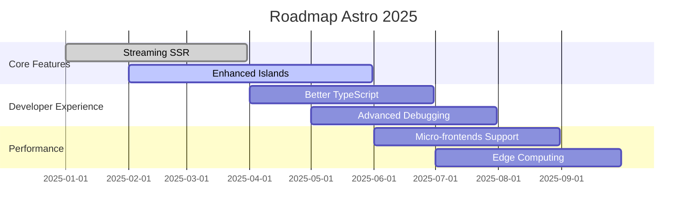

## Introduction : La Renaissance du Web Statique

Le développement web traverse une période fascinante. Après des années de complexification avec les SPAs monolithiques, nous assistons à un **retour aux sources intelligent** : le JAMstack et l'architecture en îles. Au cœur de cette révolution ? **Astro**, un framework qui repense fondamentalement notre approche du développement web moderne.

> "La simplicité est la sophistication suprême" - Léonard de Vinci

Cette citation n'a jamais été aussi pertinente dans le contexte du développement web actuel. Astro incarne cette philosophie en proposant une approche **"zero-JS by default"** révolutionnaire.

## 🏝️ L'Architecture en Îles : Un Paradigme Révolutionnaire

### Qu'est-ce que l'Architecture en Îles ?

L'architecture en îles (Islands Architecture) représente un **changement de paradigme fondamental**. Imaginez votre page web comme un océan de contenu statique parsemé d'îles interactives. Chaque île est un composant dynamique qui s'hydrate indépendamment, uniquement quand c'est nécessaire.

```astro
---
// Composant Astro - Rendu côté serveur par défaut
const posts = await fetch('/api/posts').then(r => r.json());
---

<section class="blog-grid">
  {posts.map(post => (
    <article class="post-card">
      <h2>{post.title}</h2>
      <p>{post.excerpt}</p>
      <!-- Île interactive uniquement si nécessaire -->
      <LikeButton client:visible postId={post.id} />
    </article>
  ))}
</section>
```

### Les Directives de Chargement : Le Pouvoir du Contrôle

Astro offre un **contrôle granulaire** sur le moment et la manière dont vos composants s'hydratent :

| Directive | Comportement | Cas d'usage |
|-----------|--------------|-------------|
| `client:load` | Hydratation immédiate | Composants critiques |
| `client:idle` | Hydratation quand le navigateur est inactif | Widgets non-critiques |
| `client:visible` | Hydratation lors de l'apparition à l'écran | Composants below-the-fold |
| `client:media` | Hydratation conditionnelle (media queries) | Composants responsive |
| `client:only` | Rendu côté client uniquement | Composants incompatibles SSR |

## 🚀 Performance : Les Métriques qui Comptent

### Core Web Vitals : L'Excellence Mesurée

Les **Core Web Vitals** sont devenus le standard de facto pour mesurer la performance web. Astro excelle naturellement sur ces métriques :

- **LCP (Largest Contentful Paint)** : < 2.5s
- **FID (First Input Delay)** : < 100ms  
- **CLS (Cumulative Layout Shift)** : < 0.1

```astro
---
// Optimisation automatique des images
import { Image } from 'astro:assets';
import heroImage from '../assets/hero.jpg';
---

<Image
  src={heroImage}
  alt="Architecture moderne"
  width={800}
  height={400}
  loading="lazy"
  decoding="async"
  class="hero-image"
/>
```

### Bundle Splitting Intelligent

Astro génère automatiquement des bundles optimisés :

```javascript
// Build output exemple
├── chunks/
│   ├── common-abc123.js    // Code partagé
│   ├── page-home-def456.js // Code spécifique à la page
│   └── component-xyz789.js // Composants à la demande
├── assets/
│   ├── styles-main.css     // CSS critique
│   └── styles-components.css // CSS différé
```

## 🎨 Intégrations Multi-Framework : L'Écosystème Unifié

### Bring Your Own Framework

L'une des forces d'Astro réside dans sa capacité à **unifier différents frameworks** dans un même projet :

```astro
---
// Mélange React, Vue, et Svelte dans la même page
import ReactCounter from './ReactCounter.jsx';
import VueChart from './VueChart.vue';
import SvelteWidget from './SvelteWidget.svelte';
---

<main>
  <h1>Dashboard Multi-Framework</h1>
  
  <!-- React pour la logique complexe -->
  <ReactCounter client:load initialCount={0} />
  
  <!-- Vue pour les visualisations -->
  <VueChart client:visible data={chartData} />
  
  <!-- Svelte pour les animations fluides -->
  <SvelteWidget client:idle />
</main>
```

### Migration Progressive

Cette approche permet une **migration progressive** de projets existants :

1. **Phase 1** : Migration du layout principal vers Astro
2. **Phase 2** : Conversion des pages statiques
3. **Phase 3** : Optimisation des composants interactifs
4. **Phase 4** : Remplacement progressif des frameworks legacy

## 🔧 Content Collections : La Gestion de Contenu Réinventée

### Schema-Driven Development

Les Content Collections d'Astro introduisent une approche **schema-driven** pour la gestion de contenu :

```typescript
// src/content/config.ts
import { defineCollection, z } from 'astro:content';

const blogCollection = defineCollection({
  schema: z.object({
    title: z.string(),
    description: z.string(),
    date: z.date(),
    author: z.object({
      name: z.string(),
      avatar: z.string().url(),
      bio: z.string().optional(),
    }),
    categories: z.array(z.string()),
    tags: z.array(z.string()),
    featured: z.boolean().default(false),
    draft: z.boolean().default(false),
    seo: z.object({
      canonical: z.string().url().optional(),
      openGraph: z.object({
        type: z.enum(['article', 'website']),
        image: z.string().url().optional(),
      }).optional(),
    }).optional(),
  }),
});

export const collections = {
  blog: blogCollection,
};
```

### Querying Intelligent

```astro
---
import { getCollection } from 'astro:content';

// Récupération avec filtrage et tri
const featuredPosts = await getCollection('blog', ({ data }) => {
  return data.featured && !data.draft;
});

// Tri par date décroissante
featuredPosts.sort((a, b) => b.data.date.valueOf() - a.data.date.valueOf());
---

<section class="featured-posts">
  {featuredPosts.slice(0, 3).map(async (post) => {
    const { Content } = await post.render();
    return (
      <article>
        <h2>{post.data.title}</h2>
        <Content />
      </article>
    );
  })}
</section>
```

## 🛠️ Developer Experience : L'Art du Développement Moderne

### Hot Module Replacement Ultra-Rapide

Astro utilise **Vite** sous le capot, offrant une expérience de développement incomparable :

- ⚡ Démarrage instantané (< 500ms)
- 🔥 HMR en temps réel
- 📦 Bundling optimisé pour la production
- 🎯 Tree-shaking automatique

### TypeScript First-Class

```astro
---
// Support TypeScript natif
interface BlogPost {
  title: string;
  slug: string;
  publishedAt: Date;
  author: {
    name: string;
    avatar: string;
  };
}

// Inférence de type automatique
const posts: BlogPost[] = await getCollection('blog');
---

<script>
  // TypeScript dans les scripts côté client
  const initializeAnalytics = (): void => {
    if (typeof gtag !== 'undefined') {
      gtag('config', 'GA_TRACKING_ID');
    }
  };
  
  document.addEventListener('DOMContentLoaded', initializeAnalytics);
</script>
```

## 📊 Monitoring et Analytics : Mesurer pour Optimiser

### Web Vitals Monitoring

```javascript
// src/utils/vitals.js
import { getCLS, getFID, getFCP, getLCP, getTTFB } from 'web-vitals';

function sendToAnalytics(metric) {
  // Envoi vers votre service d'analytics
  analytics.track('Web Vital', {
    name: metric.name,
    value: metric.value,
    id: metric.id,
    url: window.location.href,
  });
}

// Collecte automatique des métriques
getCLS(sendToAnalytics);
getFID(sendToAnalytics);
getFCP(sendToAnalytics);
getLCP(sendToAnalytics);
getTTFB(sendToAnalytics);
```

### Performance Budget

```json
{
  "budgets": [
    {
      "type": "bundle",
      "name": "main",
      "baseline": "50kb",
      "maximum": "100kb",
      "warning": "80kb"
    },
    {
      "type": "initial",
      "maximum": "200kb",
      "warning": "150kb"
    }
  ]
}
```

## 🌍 SEO et Accessibilité : L'Excellence Technique

### Meta Tags Dynamiques

```astro
---
export interface Props {
  title: string;
  description: string;
  image?: string;
  type?: 'website' | 'article';
}

const { title, description, image, type = 'website' } = Astro.props;
const canonicalURL = new URL(Astro.url.pathname, Astro.site);
---

<head>
  <!-- SEO Basique -->
  <title>{title}</title>
  <meta name="description" content={description} />
  <link rel="canonical" href={canonicalURL} />
  
  <!-- Open Graph -->
  <meta property="og:type" content={type} />
  <meta property="og:title" content={title} />
  <meta property="og:description" content={description} />
  <meta property="og:url" content={canonicalURL} />
  {image && <meta property="og:image" content={new URL(image, Astro.site)} />}
  
  <!-- Twitter Card -->
  <meta name="twitter:card" content="summary_large_image" />
  <meta name="twitter:title" content={title} />
  <meta name="twitter:description" content={description} />
  {image && <meta name="twitter:image" content={new URL(image, Astro.site)} />}
  
  <!-- Schema.org -->
  <script type="application/ld+json" set:html={JSON.stringify({
    "@context": "https://schema.org",
    "@type": type === 'article' ? 'BlogPosting' : 'WebSite',
    "headline": title,
    "description": description,
    "url": canonicalURL.href,
    ...(image && { "image": new URL(image, Astro.site).href })
  })} />
</head>
```

### Accessibilité Native

```astro
---
// Composant AccessibleImage
export interface Props {
  src: string;
  alt: string;
  width?: number;
  height?: number;
  loading?: 'eager' | 'lazy';
}

const { src, alt, width, height, loading = 'lazy' } = Astro.props;
---


<style>
  .responsive-image {
    max-width: 100%;
    height: auto;
    /* Réduction des mouvements pour les utilisateurs sensibles */
    @media (prefers-reduced-motion: reduce) {
      animation: none !important;
      transition: none !important;
    }
  }
</style>
```

## 🎯 Stratégies de Déploiement Modernes

### Edge Computing

```yaml
# .github/workflows/deploy.yml
name: Deploy to Edge

on:
  push:
    branches: [main]

jobs:
  deploy:
    runs-on: ubuntu-latest
    steps:
      - uses: actions/checkout@v3
      
      - name: Setup Node.js
        uses: actions/setup-node@v3
        with:
          node-version: '18'
          cache: 'npm'
      
      - name: Install dependencies
        run: npm ci
      
      - name: Build
        run: npm run build
      
      - name: Deploy to Cloudflare Pages
        uses: cloudflare/pages-action@v1
        with:
          apiToken: ${{ secrets.CLOUDFLARE_API_TOKEN }}
          accountId: ${{ secrets.CLOUDFLARE_ACCOUNT_ID }}
          projectName: mon-site-astro
          directory: dist
```

### Server-Side Rendering Adaptatif

```javascript
// astro.config.mjs
import { defineConfig } from 'astro/config';
import vercel from '@astrojs/vercel/serverless';

export default defineConfig({
  output: 'hybrid', // SSG par défaut, SSR sur demande
  adapter: vercel(),
  experimental: {
    hybridOutput: true,
  },
});
```

```astro
---
// Page avec rendu hybride
export const prerender = false; // Force le SSR pour cette page

const userLocation = Astro.request.headers.get('cf-ipcountry');
const personalizedContent = await getPersonalizedContent(userLocation);
---

<main>
  <h1>Contenu personnalisé pour {userLocation}</h1>
  <!-- Contenu dynamique basé sur la localisation -->
</main>
```

## 🔮 L'Avenir du Développement Web

### Tendances Émergentes

Le paysage du développement web évolue rapidement, et Astro se positionne à l'avant-garde de plusieurs tendances majeures :

1. **Partial Hydration** : Hydratation sélective et intelligente
2. **Streaming SSR** : Rendu en flux pour des performances optimales
3. **Edge-First Architecture** : Computing distribué au plus près des utilisateurs
4. **Zero-Bundle Size** : Composants sans impact sur le bundle client

### Roadmap Astro 2025



## 💡 Conseils Pratiques et Best Practices

### Architecture de Projet Recommandée

```
src/
├── components/           # Composants réutilisables
│   ├── ui/              # Composants UI de base
│   ├── layout/          # Composants de layout
│   └── features/        # Composants métier
├── content/             # Content Collections
│   ├── blog/           # Articles de blog
│   ├── pages/          # Pages statiques
│   └── config.ts       # Configuration des collections
├── layouts/             # Templates de page
├── pages/               # Routes de l'application
├── styles/              # Feuilles de style globales
├── utils/               # Fonctions utilitaires
└── assets/              # Images et médias
```

### Performance Checklist

- ✅ **Images optimisées** : Format WebP/AVIF avec fallbacks
- ✅ **Lazy loading** : Images et composants non-critiques
- ✅ **CSS critique inliné** : Styles above-the-fold
- ✅ **Preloading stratégique** : Ressources importantes
- ✅ **Service Worker** : Cache intelligent
- ✅ **CDN configuré** : Distribution globale
- ✅ **Compression Brotli** : Réduction de la bande passante
- ✅ **HTTP/3 activé** : Protocole de dernière génération

## Conclusion : Embrasser l'Avenir du Web

Astro représente bien plus qu'un simple framework : c'est une **vision moderne du développement web** qui réconcilie performance, simplicité et expérience développeur. En adoptant l'architecture en îles et les principes du JAMstack moderne, nous construisons des applications web plus rapides, plus maintenables et plus écologiques.

L'avenir du web se dessine aujourd'hui, et il est **statique par défaut, dynamique par nécessité**. Astro nous offre les outils pour matérialiser cette vision, en nous permettant de créer des expériences utilisateur exceptionnelles sans compromis sur les performances.

> "Le futur appartient à ceux qui croient en la beauté de leurs rêves" - Eleanor Roosevelt

Dans le contexte du développement web, cette beauté réside dans la **simplicité élégante** d'une architecture qui sait allier puissance technique et facilité d'utilisation. Astro incarne cette philosophie et nous invite à repenser notre approche du web moderne.

---

*Cet article vous a plu ? Partagez-le avec vos collègues développeurs et n'hésitez pas à me faire part de vos expériences avec Astro dans les commentaires !*

### Ressources Complémentaires

- 📖 [Documentation officielle Astro](https://docs.astro.build/)
- 🎥 [Astro Crash Course 2025](https://youtube.com/watch?v=example)
- 🛠️ [Starter Templates Astro](https://astro.build/themes/)
- 🏝️ [Islands Architecture Pattern](https://jasonformat.com/islands-architecture/)
- 📊 [Web Vitals Guide](https://web.dev/vitals/)

### Tags Techniques

`#Astro` `#JAMstack` `#WebPerformance` `#IslandsArchitecture` `#SSG` `#WebVitals` `#ModernWeb` `#DeveloperExperience`
